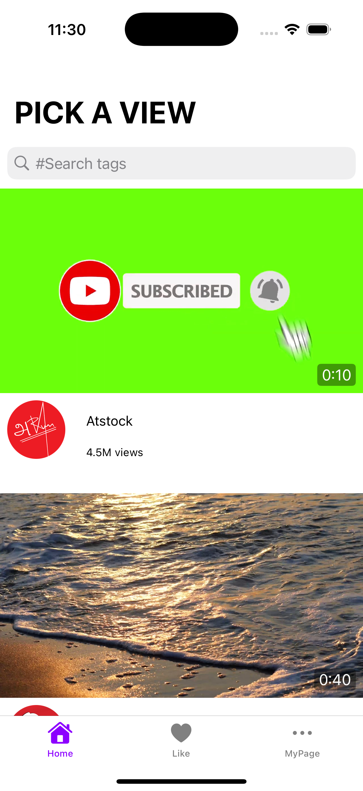
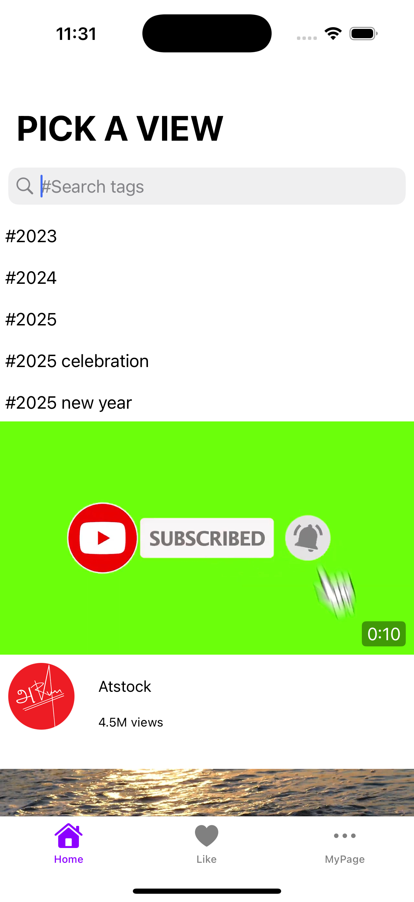
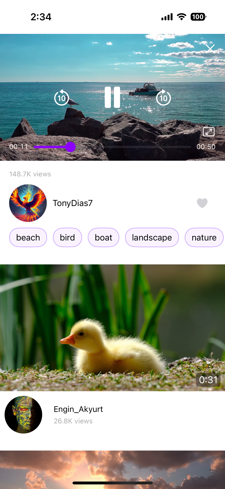
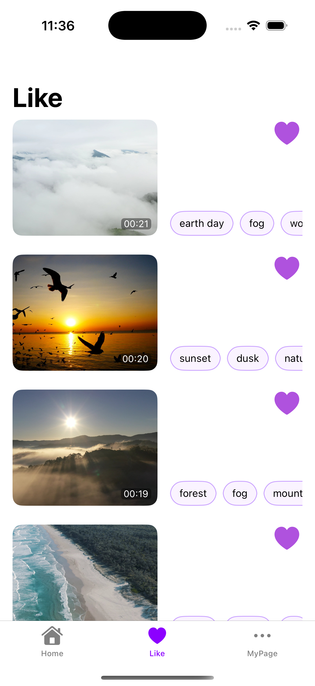
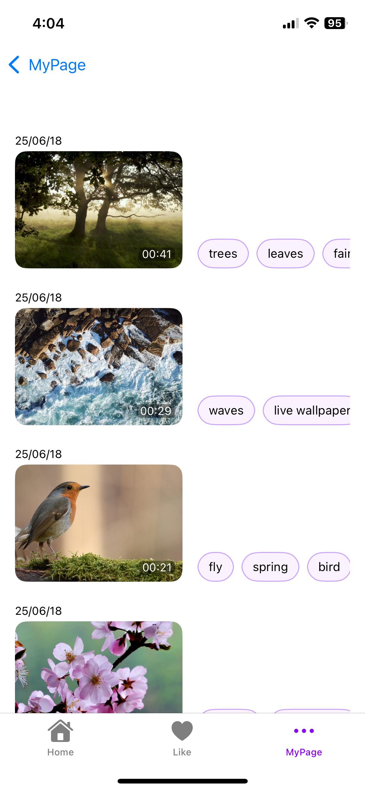
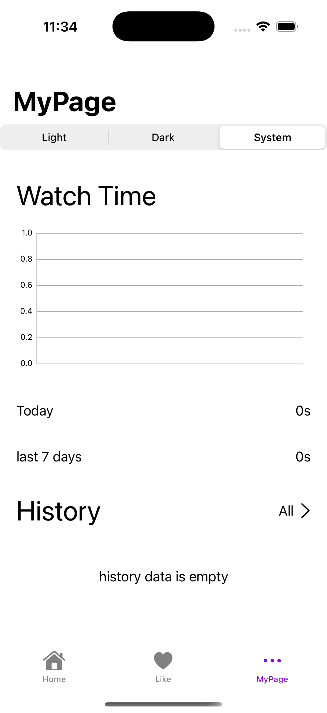

# PickaView
<h1 align="center">

   

<p align="center">
  

</p>

<h4 align="center"> 스마트 비디오 플레이어 – 시청 기록과 통계로 나만의 취향을 발견하세요..</h4>
<p align="center">
  <a href="https://swift.org">
    
  </a>
  <a href="https://github.com/rlarjsdn3/EST-2th-Team2-Project/graphs/contributors">
    
  </a>
  <br/>
 
</p>

`PickaView`는 Pixabay API를 활용하여 사용자가 다양한 비디오를 탐색하고, 개인화된 추천을 받으며, 시청 기록과 '좋아요' 목록을 관리할 수 있는 iOS 비디오 스트리밍 애플리케이션입니다.

## 🎬 주요 기능

* **비디오 탐색 및 검색**: Pixabay에서 제공하는 비디오를 탐색하고, 태그 기반의 실시간 검색 제안 기능으로 원하는 비디오를 쉽게 찾을 수 있습니다.
* **개인화 비디오 추천**: 사용자의 시청 패턴, '좋아요' 기록, 영상의 인기도 등을 종합하여 콘텐츠를 추천합니다.
* **커스텀 비디오 플레이어**: `AVKit`을 기반으로 한 커스텀 플레이어는 재생/일시정지, 10초 앞/뒤로 이동, 전체화면 전환 등 다양한 제스처 기반 컨트롤을 제공합니다.
* **'좋아요' 목록**: 마음에 드는 비디오에 '좋아요'를 표시하고, 별도의 탭에서 '좋아요'한 비디오 목록을 모아볼 수 있습니다. 이 목록은 `NSFetchedResultsController`와 `Combine`을 통해 실시간으로 업데이트됩니다.
* **마이페이지**: 최근 7일간의 시청 시간을 막대그래프로 시각화하여 제공하며, 앱의 테마(라이트/다크/시스템)를 설정할 수 있습니다.
* **반응형 UI**: 아이폰과 아이패드, 그리고 가로 및 세로 모드에 모두 대응하는 반응형 UI를 구현하여 일관된 사용자 경험을 제공합니다.

## 👨‍💻 팀원 및 역할

| 이름 | 역할 | 주요 담당 |
| --- | --- | --- |
| 장지현 | 팀장 | 회의록 작성, 추천 알고리즘 |
| 고민혁 | 팀원 | Git 관리, 설정/시청기록/좋아요 화면 |
| 김동녕 | 팀원 | 데이터 처리 |
| 이준일 | 팀원 | 발표 및 영상 제작, 플레이어 |
| 노기승 | 팀원 | 문서화, 홈 화면 |

## 🏗️ 아키텍처 및 설계 패턴

* **MVVM (Model-View-ViewModel)**: UI 로직과 비즈니스 로직을 분리하여 코드의 테스트 용이성과 유지보수성을 높였습니다. 각 화면은 `HomeViewModel`, `LikeViewModel`, `PlayerViewModel` 등 자체 ViewModel을 가집니다.
* **Singleton**: `CoreDataManager`, `ThemeManager`, `ImageCacheManager` 등 앱 전반에서 단일 인스턴스로 관리되어야 하는 객체에 싱글톤 패턴을 적용했습니다.
* **Factory**: `FRCFactory`를 통해 `NSFetchedResultsController` 객체 생성을 표준화하여 코드 중복을 줄이고 일관성을 유지했습니다.
* **Reactive Programming (Combine)**: `LikeViewModel`에서 `NSFetchedResultsControllerDelegate`와 `PassthroughSubject`를 결합하여 Core Data의 변경사항을 감지하고, UI를 반응적으로 업데이트합니다.
* **Delegate**: `PlayerViewControllerDelegate`와 같이 화면 간의 통신이 필요할 때 델리게이트 패턴을 활용하여 책임을 위임하고 결합도를 낮췄습니다.

## 🛠️ 핵심 기술 및 라이브러리

* **Swift & UIKit**: 앱의 핵심 로직과 UI를 구성합니다.
* **Core Data**: 비디오, 태그, 시청 기록, '좋아요' 상태 등 사용자 데이터를 기기에 안전하게 저장하고 관리합니다.
* **AVKit**: 비디오 재생 기능을 구현하기 위해 사용되었습니다.
* **URLSession**: Pixabay API와 통신하여 비디오 데이터를 비동기적으로 가져옵니다.
* **Combine**: 데이터 스트림을 처리하고 UI를 반응적으로 업데이트하는 데 사용됩니다.
* **DGCharts**: 마이페이지의 시청 기록 차트를 시각적으로 표현하기 위해 사용된 외부 라이브러리입니다.
* **SkeletonView**: 데이터를 로딩하는 동안 스켈레톤 UI를 표시하여 사용자 경험을 향상시키는 데 사용된 외부 라이브러리입니다.

## 📂 프로젝트 구조

```
PickaView/
├── Data
│   ├── Network         // API 통신 (APIClient, Service, DTO)
│   ├── Persistence     // CoreData 관리
│   └── UserDefault     // UserDefaults 관리 (ThemeManager)
├── Views
│   ├── Home            // 홈 화면 (추천, 검색)
│   ├── Like            // '좋아요' 목록 화면
│   ├── MyPage          // 마이페이지 (통계, 설정)
│   ├── Player          // 비디오 플레이어 화면
│   └── Root            // 탭바 컨트롤러
├── Common
│   ├── Components      // 재사용 가능한 UI 컴포넌트
│   ├── Factories       // 객체 생성 팩토리
│   └── Extensions      // 클래스 확장
├── Recommendation      // 추천 시스템 로직
└── Models              // CoreData 모델
```
## 📁 주요 뷰 화면

|  |  |
| :--: | :--: |
| 🏠 홈 화면 | 🔍 검색 화면 |

|  |  |
| :--: | :--: |
| 🎬 재생 화면  |  재생 화면(전체화면) |

|  |  |
| :--: | :--: |
| ❤️ 좋아요 화면 | 🕘 시청 기록 화면 |

|  |
| :--: |
| 🏷️ 마이 페이지 |


## 👨‍👩‍👧‍👦 기여자

|  |  |  |  |  |
| :---: | :---: | :---: | :---: | :---: |
| [장지현](https://github.com/jihyeonjjang) | [고민혁](https://github.com/TeddKo) | [김동녕](https://github.com/kdn0325) | [이준일](https://github.com/vinyl-nyl) | [노기승](https://github.com/giseungNoh) |


---
